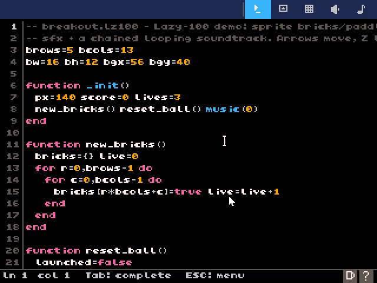

# Lazy-100

A **fantasy game console** in the spirit of PICO-8 / TIC-80 / basic8, but a
notch more capable: a readable **320×240** screen, a **256-color** palette, **16×16**
sprites, 4-channel chip audio, a full in-console editor suite, and scripting in
**Lua 5.4**. It stands on the shoulders of
[VRI](https://github.com/zzxzzk115/VRI), a cross-backend Render Hardware Interface
(Vulkan / D3D12 / Metal / WebGPU / OpenGL / OpenGL ES / WebGL).

**▶ Play it in the browser: <https://zzxzzk115.github.io/Lazy-100/>** — the full console
(shell + editors included), a browsable cart catalog, and touch controls on phones/tablets.



## Specs

| | |
|---|---|
| Screen | 320×240, indexed (1 byte/pixel) |
| Palette | 256 colors (fully re-definable) |
| Sprites | 16×16 px, 16×16 sheet = 256 sprites (256×256 px) |
| Map | 128×64 tiles |
| Audio | 4 channels, 64 sfx patterns, 64-row song sequencer |
| Script | Lua 5.4 (sol2) |
| Cart | `.lz100` text (code + gfx + flags + map + audio + label) or a shareable `.lz100.png` cartridge (the cart hides inside the image) |

The console also runs **p8** carts natively through a vendored fixed-point **z8lua** VM
(dual-VM routing — p8 carts get the real dialect, not a transpile).

## Editors

Everything is made inside the console: command-line **shell**, **code** editor (with a
cheatsheet + completion), **sprite**, **map**, **sfx** and **music tracker** editors,
plus an online **explore** browser for the
[Lazy-100-games](https://github.com/zzxzzk115/Lazy-100-games) catalog. `save mygame`
writes a `.lz100`; `save mygame.png` mints the cartridge PNG with your title/author.

## Stack

- **VRI** — rendering (Vulkan backend by default)
- **SDL3** — window + keyboard/gamepad input
- **miniaudio** — audio output
- **Lua 5.4 + sol2** — cart scripting (+ vendored **z8lua** for p8 carts)

## Download

Prebuilt binaries (console + `cartshot`/`cartwav` tools) for Windows / Linux / macOS are
attached to [GitHub Releases](https://github.com/zzxzzk115/Lazy-100/releases).

## Build

Requires [xmake](https://xmake.io).

```sh
xmake                                    # configure + build
xmake run lazy100 [cart.lua|.lz100|.p8]  # run the console
bash scripts/build_site.sh               # wasm console + the whole website -> build/site
```

Host tools: `xmake build cartshot` (headless cart screenshot → PNG) and
`xmake build cartwav` (headless music render → WAV).

## Docs

[docs/DESIGN.md](docs/DESIGN.md) for the architecture, [docs/CHEATSHEET.md](docs/CHEATSHEET.md)
for the API. 中文文档见 [docs/zh_CN/](docs/zh_CN/).

## Credits

- Built-in font: CJK from **[Fusion Pixel Font](https://github.com/TakWolf/fusion-pixel-font)**
  (缝合像素字体, 8px monospaced) by **TakWolf** and contributors, under the
  [SIL OFL 1.1](assets/fonts/fusion-pixel-OFL.txt) — see [assets/fonts/](assets/fonts/);
  Latin bitmap glyphs adapted from **[TIC-80](https://github.com/nesbox/TIC-80)** (MIT).
  Rasterized at runtime with **stb_truetype** so `print()` renders any UTF-8 (Latin + 中日韩).
- p8 compatibility: vendored **[z8lua](https://github.com/samhocevar/z8lua)** fork by
  **Sam Hocevar** (fixed-point Lua with the p8 dialect).
- Renders through [VRI](https://github.com/zzxzzk115/VRI).

## License

[MIT](./LICENSE) © Lazy_V (project code; bundled assets keep their own licenses — see [Credits](#credits))
